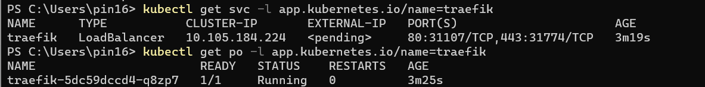

# **บันทึกขั้นตอนการติดตั้ง Kubernetes by miniKube**

**Ref.**

- https://minikube.sigs.k8s.io/docs/start/

**Url.Traefik deploy**

- https://traefik.spcn07.local/dashboard/#/

**Url.web deploy**

-  http://web.spcn07.local/

**Wakatime Projects · Kube**

- https://wakatime.com/@spcn07/projects/lbonimkouf?start=2023-03-12&end=2023-03-18

## **หัวข้อที่ศึกษา**

- [1.kubectl](#1kubectl)
- [2.minikube](#2minikube)
- [3.docker engine ](#3-docker-engine)
- [4.Example minikube Deploy-app](#4minikube-deploy-app)
- [5.Traefik deploy บน miniKube](#5traefik-deploy-บน-minikube)
- [6.web deploy ](#6web-deploy)

# **1.kubectl**

**1.1 Install kubectl**

- ค้นหา Install kubectl
  หรือกดที่ Link : https://kubernetes.io/docs/tasks/tools/install-kubectl-windows/
   <details>
    <summary>Show Images</summary>
    
    <center>  </center>
    
    </details>
  

**1.2 Copy คำสั่งต่างๆตามขั้นตอน**

- 1.2.1ดาวโหลดรุ่นล่าสุด version1.26.0
  โดยใช้คำสั่ง :
  <details>
  <summary>Show code</summary>

    ```ruby
      curl.exe -LO          "https://dl.k8s.io/release/v1.26.0/bin/windows/amd64/kubectl.exe"
    ```
</details>

* ตรวจสอบ binary

  - ทำการดาวโหลด kubectl checksum file โดยใช้คำสั่ง :
  <details>
  <summary>Show code</summary>

  ```ruby
  curl.exe -LO "https://dl.k8s.io/v1.26.0/bin/windows/amd64/kubectl.exe.sha256"
  ```

    </details>

**1.3 การใช้ command promt**

- 1.3.1) สร้างโฟลเดอร์ชื่อ kubectl
    <details>
    <summary>Show Images</summary>
    
    <center>  </center>
    
</details>
    

- 1.3.2) รันคำสั่งในข้อที่ 1.2.1
    <details>
    <summary>Show Images</summary>
    
    <center>  </center>
    
</details>

  

- 1.3.3) ปรับ Environment

    - Search "Edit the system environment varibles"
        <details>
        <summary>Show Images</summary>
        
        <center>  </center>
        
    </details>
    

    - กด Environment Variables
        <details>
        <summary>Show Images</summary>
        
        <center>  </center>
        
    </details>
    
    * เลือก Path
        <details>
        <summary>Show Images</summary>
        
        <center>  </center>
        
    </details>
    

    * กด New และเพิ่ม Path "C:\kubectl" เสร็จแล้วกด ok
        <details>
        <summary>Show Images</summary>
        
        <center>  </center>
        
    </details>


- 1.3.4) ทดสอบเพื่อให้แน่ใจว่าเวอร์ชันของ kubectl เหมือนกับที่ดาวน์โหลดมา
  โดยรันคำสั่ง
  <details>
  <summary>Show code</summary>

    ```ruby
      kubectl version --client
    ```

  </details>

- 1.3.5) รันคำสั่งนี้ต่อ
    <details>
    <summary>Show code</summary>

  ```ruby
  kubectl version --client --output=yaml
  ```

    </details>
    ผลลัพธ์การรัน
    <details>
    <summary>Show Images</summary>
    
    <center>  </center>
    
</details>
    

# **2.minikube**

**2.1 Install minikube**

- ค้นหา Install minikube หรือกดที่ Link : https://minikube.sigs.k8s.io/docs/start/
    <details>
    <summary>Show Images</summary>
    
    <center>  </center>
    
</details>
  

**2.2 ติดตั้งตามเว็บไซต์**

- 2.2.1) เลือก Spec ที่จะติดตั้ง
    <details>
    <summary>Show Images</summary>
    
    <center>  </center>
    
</details>
 

- 2.2.2) ดาวน์โหลดและเรียกใช้โปรแกรมติดตั้งสำหรับรุ่นล่าสุด หรือถ้าใช้ PowerShell
  ให้ใช้คำสั่งนี้:
  <details>
  <summary>Show code</summary>

    ```ruby
      New-Item -Path 'c:\' -Name 'minikube' -ItemType     Directory -Force
      Invoke-WebRequest -OutFile 'c:\minikube\minikube.exe' -Uri              'https://github.com/kubernetes/minikube/releases/latest/download/minikube-windows-  amd64.exe' -UseBasicParsing
    ```

</details>

- 2.2.3) เพิ่มไบนารี minikube.exe ใน PATH ของคุณ ตรวจสอบให้แน่ใจว่าได้เรียกใช้ PowerShell ในฐานะ Administrator.
    <details>
    <summary>Show code</summary>

  ```ruby
  $oldPath = [Environment]::GetEnvironmentVariable('Path',    [EnvironmentVariableTarget]::Machine)
  if ($oldPath.Split(';') -inotcontains 'C:\minikube'){ `
  [Environment]::SetEnvironmentVariable('Path', $('{0};C:\minikube' -f $oldPath),   [EnvironmentVariableTarget]::Machine) `
  }
  ```

    </details>

- 2.2.4) ทดสอบการเรียกใช้งาน minikube ใน command prompt : ถ้าสามารถเรียกใช้งานได้ถือว่าจบขั้นตอน
  - ผลลัพธ์ที่ได้
    <details>
    <summary>Show Images</summary>
        
    <center>  </center>
        
    </details>
  

# **3. docker engine**

**3.1 Install Docker Desktop**

- ค้นหา Install Docker Desktop
  หรือกดที่ Link :https://docs.docker.com/desktop/install/windows-install/

**3.2 เลือกตัวจำลองในการเอา minikube ไปรัน**

- 3.2.1) **Docker**

  Ref. https://minikube.sigs.k8s.io/docs/drivers/docker/

- run คำสั่งใน command promt \* เริ่ม cluster โดยการใช้ docker driver
  ใช้คำสั่ง:
  <details>
  <summary>Show code</summary>

  ```ruby
    minikube start --driver=docker
    ```
</details>
    ผลลัพธ์
    <details>
    <summary>Show Images</summary>
            
<center>  </center>
            
</details>


* set ให้ Docker เป็นค่า Default
    <details>
    <summary>Show code</summary>

    ```ruby
    minikube config set driver docker
    ```
</details>

- หลังรันเสร็จเช็ค images และ Containers ที่ Docker Desktop

  - Images
  <center></center>

  - Containers
  <center></center>

  - ดู pod ที่ถูกสร้าง
    ใช้คำสั่ง :
    <details>
    <summary>Show code</summary>

    ```ruby
    kubectl get pod -A
    ```
</details>
    ผลลัพธ์: จะเห็นได้ว่ามีหลาย nodes ที่ถูกสร้าง
     <details>
    <summary>Show Images</summary>
    
    <center>  </center>
    
    </details>
      

  - จำลองในแลปที่เล็กที่สุดของ cluster ซึ่ง node ทั้งหมดที่สร้างจะถูกรวมไว้ใน minikube เหลือเพียง node เดียว

    ใช้คำสั่ง:
      <details>
          <summary>Show code</summary>

    ```ruby
       kubectl get nodes
    ```

      </details>
      ผลลัพธ์
       <details>
    <summary>Show Images</summary>
    
    <center>  </center>
    
    </details>
       

**3.3 ทดลองเปิด minikube dashboard**

- รันคำสั่งเพื่อ Dashboard minikube

  ใช้คำสั่ง :
    <details>
    <summary>Show code</summary>

  ```ruby
     minikube dashboard
  ```

    </details>

- ผลลัพธ์
    <center></center>

# **4.Example minikube Deploy-app**

       ทดลองตามอาจารย์-> ไว้อ่านสอบ

Ref.

- https://minikube.sigs.k8s.io/docs/start/

**4.1 Deploy applications service**

- ใช้คำสั่ง :
    <details>
    <summary>Show code</summary>
    
    ```ruby
    kubectl create deployment hello-minikube --image=kicbase/echo-server:1.0
    kubectl expose deployment hello-minikube --type=NodePort --port=8080
    ```
  </details>
     ผลลัพธ์ : 
     - ทำการสร้าง Containers ที่ชื่อว่า hello-minikube 
     - ทำการสร้าง service ที่เป็นชนิดของ NodePort
     <details>
    <summary>Show Images</summary>
    
    <center>  </center>
    
</details>
    

- เช็ค minikube dashboard จะมีข้อมูลต่างๆขึ้น
    <center></center>

- ทดสอบการเชื่อมต่อ ว่ามี service ที่เราสร้าง run อยู่มั้ย

  - ใช้คำสั่ง :
    <details>
    <summary>Show code</summary>

        ```ruby
        kubectl get services hello- minikube

        ```

    </details>
    ผลลัพธ์
    <details>
    <summary>Show Images</summary>
    
    <center>  </center>
    
</details>
   

- ทำการ Forward Port

  - ใช้คำสั่ง :
    <details>
    <summary>Show code</summary>

        ```ruby

    kubectl port-forward service/hello- minikube 7080:8080

        ```

    </details>
    ผลลัพธ์
        <details>
        <summary>Show Images</summary>
        
    <center>  </center>
        
    </details>
        
**4.1 Deploy applications LoadBalancer**

- ทำเพิ่มเติม

  Ref.: https://minikube.sigs.k8s.io/docs/start/

* Deploy application -> LoadBalancer

  - ปรับใช้ LoadBalancer
    ใช้คำสั่ง :
    <details>
    <summary>Show code</summary>

        ```ruby

    kubectl create deployment balanced --image=kicbase/echo-server:1.0
    kubectl expose deployment balanced --type=LoadBalancer --port=8080
    ```
    </details>
            ผลลัพธ์
            <details>
    <summary>Show Images</summary>
    
    <center>  </center>
    
</details>

   

* เช็ค minikube dashboard :
     <center>  </center>

* ตรวจสอบ service
  ใช้คำสั่ง :
  <details>
    <summary>Show code</summary>
    
    ```ruby
       kubectl get services balanced
    ```
    </details>
   
    -  ผลลัพธ์ : จะเห็นได้ว่า Services balanced มีสถานะ Pending อยู่
    <center>  </center>

  - แก้ไข :โดยการสร้าง tunnel เพื่อ External-Ip กับ localhost
    ใช้คำสั่ง:
    <details>
    <summary>Show code</summary>

     ```ruby
        minikube tunnel
    ```

    </details>
    ผลลัพธ์ของการแก้ไข
    <details>
    <summary>Show Images</summary>
    
    <center>  </center>
    
</details>
        

# **5.Traefik deploy บน miniKube**

- Ref.https://github.com/iamapinan/kubeplay-traefik

**5.1 ขั้นตอนการติดตั้ง**

- 5.1.1) ติดตั้งทรัพยากรสำหรับ treafik
  ใช้คำสั่ง:
  <details>
  <summary>Show code</summary>
      ```ruby
      kubectl apply -f                https://raw.githubusercontent.com/traefik/traefik/v2.9/docs/content/reference/dynamic-  configuration/kubernetes-crd-definition-v1.yml
      ```
  </details>


ผลลัพธ์
<details>
<summary>Show Images</summary>
    
<center>  </center>
    
</details>


- 5.1.2) ติดตั้ง RBAC สำหรับ treafik-
  ใช้คำสั่ง:
  <details>
    <summary>Show code</summary>

      ```ruby
  kubectl apply -f https://raw.githubusercontent.com/traefik/traefik/v2.9/docs/content/reference/dynamic-configuration/kubernetes-crd-rbac.yml
  ```
</details>
  ผลลัพธ์
  <details>
    <summary>Show Images</summary>
    
<center>  </center>
    
</details>
  

- 5.1.3) ติดตั้ง Scoop โดย PowerShell terminal
    
    ใช้คำสั่ง :
    <details>
    <summary>Show code</summary>

    ```ruby
    > Set-ExecutionPolicy RemoteSigned -Scope CurrentUser
    > irm get.scoop.sh | iex
    ```
    </details>
  ผลลัพธ์
    <details>
    <summary>Show Images</summary>
        
    <center>  </center>
        
    </details>
        


- 5.1.4) เช็ค scoop ว่าติดตั้งเรียบร้อยมั้ย และติดตั้ง helm
ใช้คำสั่ง :
    <details>
    <summary>Show code</summary>

    ```ruby
   > scoop #เช็ค scoop ว่าติดตั้งเรียบร้อยมั้ย
   > scoop install helm #ติดตั้ง helm
    ```

</details>

- 5.1.5) ติดตั้ง Traefik Helmchart
  ใช้คำสั่ง :
    <details>
    <summary>Show code</summary>

    ```ruby
    > helm repo add traefik https://traefik.github.io/charts
    > helm repo update
    > helm install traefik traefik/traefik
    ```
</details>

- 5.1.6) ตรวจสอบ service ว่า run อยู่มั้ย
  ใช้คำสั่ง :
  <details>
  <summary>Show code</summary>

    ```ruby
    > kubectl get svc -l app.kubernetes.io/name=traefik
    > kubectl get po -l app.kubernetes.io/name=traefik
    ```

</details>

ผลลัพธ์ : จะเห็นได้ว่า Services traefik มีสถานะ Pending อยู่
<center> </center>

- แก้ไข :โดยการสร้าง tunnel เพื่อ External-Ip กับ localhost
  ใช้คำสั่ง:
    <details>
    <summary>Show code</summary>

  ```ruby
  minikube tunnel
  ```

</details>
    ผลลัพธ์ของการแก้ไข
        <center>  </center>

- 5.1.7) แก้ไขไฟล์ host เพื่อเพิ่ม ip สำหรับเข้าถึง treafik
  - โดยเปิด C:\Windows\System32\drivers\etc
    
        เพิ่มip : 127.0.0.1 traefik.spcn07.local
     <details>
    <summary>Show Images</summary>
    
    <center>  </center>
    
    </details>
     
- 5.1.8) รันคำสั่ง How to create secrete
  Ref.https://github.com/iamapinan/kubeplay-traefik

  - ติดตั้ง apache2-utils
    ใช้คำสั่ง:
    <details>
    <summary>Show code</summary>

     ```ruby
    sudo apt install apache2-utils
    ```
</details>

- รันคำสั่งต่อไปนี้
    ใช่คำสั่ง :
    <details>
    <summary>Show code</summary>

    ```ruby
     > htpasswd -nB user | tee auth-secret  #รันก่อน
     > kubectl create secret generic -n traefik dashboard-auth-secret --from-   file=users=auth-secret -o yaml --dry-run=client | tee dashboard-secret.yaml
     ```
</details>


- 5.1.9) แก้ไขไฟล์ traefik-dashboard

  Ref.https://github.com/iamapinan/kubeplay-traefik

  - แก้ไข namespce : default
    <details>
    <summary>Show Images</summary>
    
    <center>  </center>
    
    </details>

  - แก้ไข user: - โดยการ Copy User
    <details>
    <summary>Show Images</summary>
    
    <center>  </center>
    
    </details>

  * และนำ User ที่ copy ไปแก้ไขที่ไฟล์ traefik-dashboard.yaml
    <details>
    <summary>Show Images</summary>
    
    <center>  </center>
    
    </details>
 

  - แก้ไข Url.ในการเข้าถึง : - โดยใส่โดเมน traefik.spcn07.local
    <details>
    <summary>Show Images</summary>
    
    <center>  </center>
    
    </details>
  

- 5.1.10) เช็ค Url.traefik dashboard

  LinK : https://traefik.spcn07.local/dashboard/#/

    <center>  </center>

# **6.web deploy**

- 6.1) รวมไฟล์ ingress-deployment เข้ากับ nginx-deployment ในชื่อ rancher.yaml

- 6.2) แก้ไขไฟล์ rancher.yaml
   <details>
      <summary>Show code</summary>

    ```ruby
    apiVersion: apps/v1
    kind: Deployment
    metadata:
        name: rancher-deployment #เปลี่ยนชื่อเป็น rancher
        namespace: default #ทุก namespace ตั้งค่าเป็น default
    spec:
        replicas: 1
        selector:
        matchLabels:
            app: rancher #ตั้งชื่อ App
        template:
          metadata:
            labels:
                app: rancher
          spec:
            containers: 
            - name: rancher
              image: rancher/hello-world #ชื่อ images  rancher/hello-world
              ports: 
              - containerPort: 80
     ---
    apiVersion: v1
    kind: Service
    metadata:
        name: rancher-service
        labels:
            name: rancher-service #ตั้งชื่อ service ของเรา
        namespace: default #ทุก namespace ตั้งค่าเป็น default
    spec:
        selector:
            app: rancher
    ports:
    - name: http
        port: 80
        protocol: TCP
        targetPort: 80
    --- #รวมไฟล์ ingress
    apiVersion: traefik.containo.us/v1alpha1
    kind: IngressRoute
    metadata:
        name: traefik-ingress
        namespace: default
    spec:
        entryPoints: 
            - web 
            - websecure
        routes:
        - match: Host(`web.spcn07.local`) #ชื่อโดเมนเว็บของเรา
        kind: Rule
        services:
        - name: rancher-service #ตั้งชื่อ service ของเรา
          port: 80
  ```
  </details>

- 6.3) เพิ่ม host Domain โดยเปิด C:\Windows\System32\drivers\etc 
        
        เพิ่ม ip : 127.0.0.1 web.spcn07.local
    <details>
    <summary>Show Images</summary>
    
    <center>  </center>
    
    </details>
  
- 6.4) ลอง 
Deployด้วยคำสั่ง :
    <details>
    <summary>Show code</summary>
    
    ```ruby
    > kubectl apply -f traefik-   dashboard.yaml
    > kubectl apply -f nginx-deployment.yaml
    > kubectl apply -f ingress-deployment.yaml
    ```
</details>

- 6.5) เช็คการเข้าถึง Url.

   Link: http://web.spcn07.local/

    ผลลัพธ์
    <center>  </center>   
 
